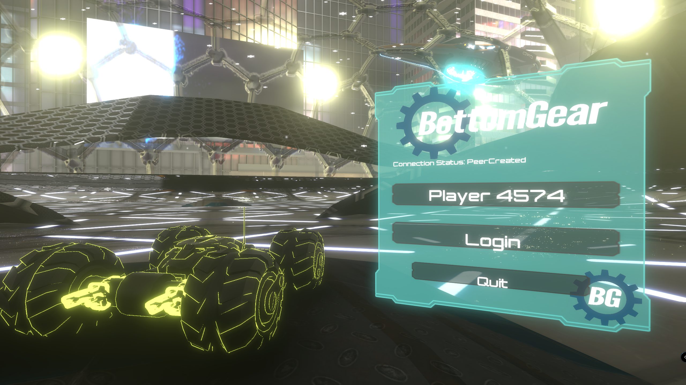
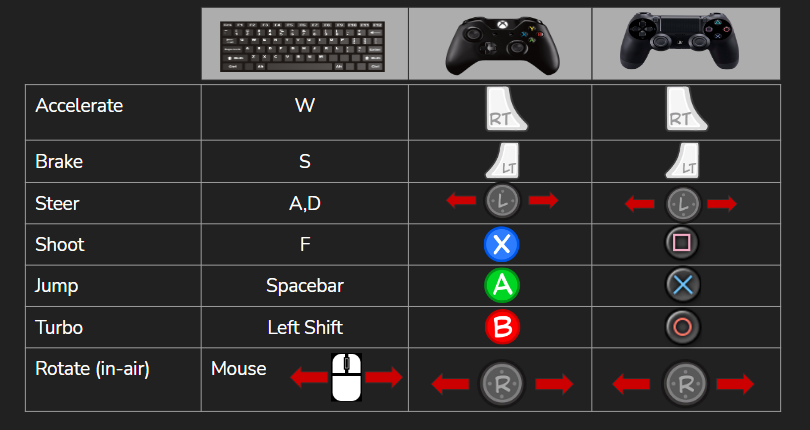

## Welcome to Bottom Gear

A multiplayer game made by a group of 4 university students in Unity using PUN2 in the span of 1 month.

## Gameplay

<iframe width="800" height="480" src="https://www.youtube.com/embed/AkXQa17olLg" frameborder="0" allow="accelerometer; autoplay; clipboard-write; encrypted-media; gyroscope; picture-in-picture" allowfullscreen></iframe>

## How to use:

## Authors:

We are:

* GitHub account: [AitorSimona](https://github.com/AitorSimona)
* GitHub account: [CarlesHoms](https://github.com/ch0m5)
* GitHub account: [DidacRomero](https://github.com/DidacRomero)
* GitHub account: [VictorChen](https://github.com/Scarzard)

## Tools
- Visual Studio 2019
- Unity 2020.2.0f1
- Photon PUN2
- Wwise 2019.2.7.7402

## Thanks / References

- https://github.com/rlbogue/Rbogue (UI Gauge base)
- https://github.com/Unity-Technologies/BoatAttack 
- https://github.com/Unity-Technologies/UniversalRenderingExamples
- https://medium.com/@porter.johnross/unity-custom-rendering-and-improved-outlines-in-the-universal-render-pipeline-506d5f3ce496
